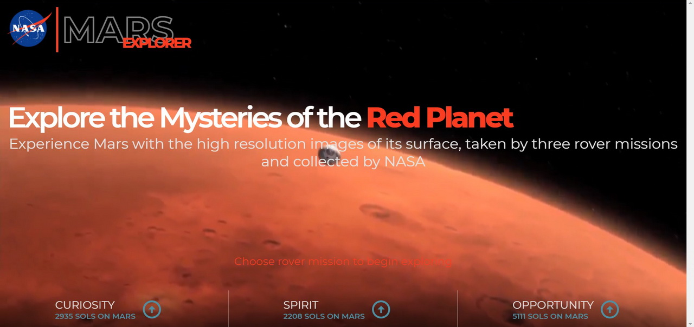

# Mars explorer

Mars Explorer - is basically a gallery of high resolution images of Mars surface, taken by three rovers: Curiosity, Spirit and Oportunity during thir missions. The user can interact with the app interface in 3 steps:
* Step 1: Choose mission
* Step 2: Select rover's camera and [sol](https://en.wikipedia.org/wiki/Sol_(day_on_Mars))
* Step 3: Click "explore" button  
When done, the gallery overlay appeares where you can enjoy the beauty of the Red Planet.

## Libraries and dependencies used

* [React](https://reactjs.org/)
* [query-string](https://github.com/sindresorhus/query-string)
* [react-spinners](https://www.npmjs.com/package/react-spinners)
* [react-icons](https://react-icons.github.io/react-icons/)
* [react-modal](https://github.com/reactjs/react-modal)